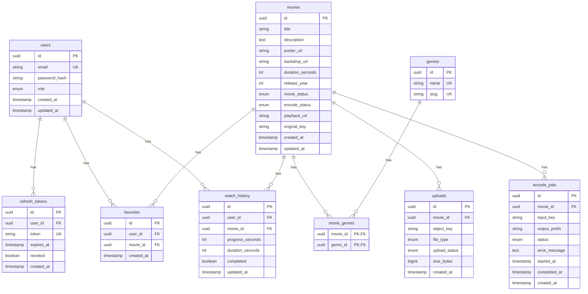

# DATABASE_SCHEMA.md – netflop

> **Phiên bản:** 1.0  
> **Ngày tạo:** 01-01-2026  
> **Tác giả:** System Architect

---

## Mục lục

1. [Entity Relationship Diagram (ERD)](#1-entity-relationship-diagram-erd)
2. [Chi tiết từng bảng](#2-chi-tiết-từng-bảng)
3. [Enums](#3-enums)
4. [Business Rules Mapping](#4-business-rules-mapping)
5. [Prisma Schema](#5-prisma-schema)

---

# 1. Entity Relationship Diagram (ERD)



---

# 2. Chi tiết từng bảng

## 2.1 users

Lưu thông tin người dùng (viewer + admin).

| Column | Type | Required | Default | Description |
|--------|------|----------|---------|-------------|
| `id` | `UUID` | ✅ | `gen_random_uuid()` | Primary key |
| `email` | `VARCHAR(255)` | ✅ | - | Email đăng nhập, unique |
| `password_hash` | `VARCHAR(255)` | ✅ | - | Bcrypt hash |
| `role` | `user_role` | ✅ | `'viewer'` | Enum: viewer / admin |
| `created_at` | `TIMESTAMPTZ` | ✅ | `now()` | Thời điểm tạo |
| `updated_at` | `TIMESTAMPTZ` | ✅ | `now()` | Thời điểm cập nhật |

**Constraints:**
- `PK`: `id`
- `UNIQUE`: `email`

**Indexes:**
- `idx_users_email` on `email` (cho login lookup)

---

## 2.2 refresh_tokens

Lưu refresh tokens để quản lý session.

| Column | Type | Required | Default | Description |
|--------|------|----------|---------|-------------|
| `id` | `UUID` | ✅ | `gen_random_uuid()` | Primary key |
| `user_id` | `UUID` | ✅ | - | FK → users.id |
| `token` | `VARCHAR(512)` | ✅ | - | Refresh token string |
| `expires_at` | `TIMESTAMPTZ` | ✅ | - | Thời điểm hết hạn |
| `revoked` | `BOOLEAN` | ✅ | `false` | Đã thu hồi chưa |
| `created_at` | `TIMESTAMPTZ` | ✅ | `now()` | Thời điểm tạo |

**Constraints:**
- `PK`: `id`
- `FK`: `user_id` → `users.id` ON DELETE CASCADE
- `UNIQUE`: `token`

**Indexes:**
- `idx_refresh_tokens_token` on `token` (cho verify)
- `idx_refresh_tokens_user_id` on `user_id`

---

## 2.3 movies

Lưu thông tin phim / video.

| Column | Type | Required | Default | Description |
|--------|------|----------|---------|-------------|
| `id` | `UUID` | ✅ | `gen_random_uuid()` | Primary key |
| `title` | `VARCHAR(500)` | ✅ | - | Tiêu đề phim |
| `description` | `TEXT` | ❌ | `NULL` | Mô tả chi tiết |
| `poster_url` | `VARCHAR(1000)` | ❌ | `NULL` | URL ảnh poster |
| `backdrop_url` | `VARCHAR(1000)` | ❌ | `NULL` | URL ảnh backdrop (hero) |
| `duration_seconds` | `INTEGER` | ❌ | `NULL` | Thời lượng video (giây) |
| `release_year` | `INTEGER` | ❌ | `NULL` | Năm phát hành |
| `movie_status` | `movie_status` | ✅ | `'draft'` | Enum: draft / published |
| `encode_status` | `encode_status` | ✅ | `'pending'` | Enum: pending / processing / ready / failed |
| `playback_url` | `VARCHAR(1000)` | ❌ | `NULL` | URL master.m3u8 khi encode xong |
| `original_key` | `VARCHAR(500)` | ❌ | `NULL` | Object key của file gốc (originals/...) |
| `created_at` | `TIMESTAMPTZ` | ✅ | `now()` | Thời điểm tạo |
| `updated_at` | `TIMESTAMPTZ` | ✅ | `now()` | Thời điểm cập nhật |

**Constraints:**
- `PK`: `id`

**Indexes:**
- `idx_movies_status` on `(movie_status, encode_status)` — filter phim công khai
- `idx_movies_title_search` on `title` using GIN `gin_trgm_ops` — full-text search (hoặc ILIKE)
- `idx_movies_created_at` on `created_at DESC` — sort mới nhất

---

## 2.4 genres

Danh mục thể loại phim.

| Column | Type | Required | Default | Description |
|--------|------|----------|---------|-------------|
| `id` | `UUID` | ✅ | `gen_random_uuid()` | Primary key |
| `name` | `VARCHAR(100)` | ✅ | - | Tên hiển thị (Action, Comedy...) |
| `slug` | `VARCHAR(100)` | ✅ | - | URL-friendly slug |

**Constraints:**
- `PK`: `id`
- `UNIQUE`: `name`
- `UNIQUE`: `slug`

---

## 2.5 movie_genres

Bảng liên kết many-to-many giữa movies và genres.

| Column | Type | Required | Default | Description |
|--------|------|----------|---------|-------------|
| `movie_id` | `UUID` | ✅ | - | FK → movies.id |
| `genre_id` | `UUID` | ✅ | - | FK → genres.id |

**Constraints:**
- `PK`: `(movie_id, genre_id)` (composite)
- `FK`: `movie_id` → `movies.id` ON DELETE CASCADE
- `FK`: `genre_id` → `genres.id` ON DELETE CASCADE

**Indexes:**
- `idx_movie_genres_genre_id` on `genre_id` (query movies by genre)

---

## 2.6 favorites

Danh sách phim yêu thích của user.

| Column | Type | Required | Default | Description |
|--------|------|----------|---------|-------------|
| `id` | `UUID` | ✅ | `gen_random_uuid()` | Primary key |
| `user_id` | `UUID` | ✅ | - | FK → users.id |
| `movie_id` | `UUID` | ✅ | - | FK → movies.id |
| `created_at` | `TIMESTAMPTZ` | ✅ | `now()` | Thời điểm thêm |

**Constraints:**
- `PK`: `id`
- `FK`: `user_id` → `users.id` ON DELETE CASCADE
- `FK`: `movie_id` → `movies.id` ON DELETE CASCADE
- `UNIQUE`: `(user_id, movie_id)` — không cho trùng

**Indexes:**
- `idx_favorites_user_id` on `user_id`

---

## 2.7 watch_history

Lịch sử xem của user, dùng cho Continue Watching và Resume.

| Column | Type | Required | Default | Description |
|--------|------|----------|---------|-------------|
| `id` | `UUID` | ✅ | `gen_random_uuid()` | Primary key |
| `user_id` | `UUID` | ✅ | - | FK → users.id |
| `movie_id` | `UUID` | ✅ | - | FK → movies.id |
| `progress_seconds` | `INTEGER` | ✅ | `0` | Vị trí đang xem (giây) |
| `duration_seconds` | `INTEGER` | ✅ | `0` | Tổng thời lượng (denormalize) |
| `completed` | `BOOLEAN` | ✅ | `false` | Đã xem xong (>= 90%) |
| `updated_at` | `TIMESTAMPTZ` | ✅ | `now()` | Lần cập nhật cuối |

**Constraints:**
- `PK`: `id`
- `FK`: `user_id` → `users.id` ON DELETE CASCADE
- `FK`: `movie_id` → `movies.id` ON DELETE CASCADE
- `UNIQUE`: `(user_id, movie_id)` — mỗi user + movie 1 record

**Indexes:**
- `idx_watch_history_user_updated` on `(user_id, updated_at DESC)` — Continue Watching query
- `idx_watch_history_continue` on `(user_id)` WHERE `progress_seconds > 0 AND completed = false` — partial index

---

## 2.8 uploads

Theo dõi file upload (thumbnail, video).

| Column | Type | Required | Default | Description |
|--------|------|----------|---------|-------------|
| `id` | `UUID` | ✅ | `gen_random_uuid()` | Primary key |
| `movie_id` | `UUID` | ✅ | - | FK → movies.id |
| `object_key` | `VARCHAR(500)` | ✅ | - | S3/MinIO object key |
| `file_type` | `upload_file_type` | ✅ | - | Enum: video / thumbnail |
| `upload_status` | `upload_status` | ✅ | `'uploading'` | Enum: uploading / uploaded / failed |
| `size_bytes` | `BIGINT` | ❌ | `NULL` | Kích thước file |
| `created_at` | `TIMESTAMPTZ` | ✅ | `now()` | Thời điểm tạo |

**Constraints:**
- `PK`: `id`
- `FK`: `movie_id` → `movies.id` ON DELETE CASCADE

**Indexes:**
- `idx_uploads_movie_id` on `movie_id`

---

## 2.9 encode_jobs

Theo dõi encode jobs (queue).

| Column | Type | Required | Default | Description |
|--------|------|----------|---------|-------------|
| `id` | `UUID` | ✅ | `gen_random_uuid()` | Primary key |
| `movie_id` | `UUID` | ✅ | - | FK → movies.id |
| `input_key` | `VARCHAR(500)` | ✅ | - | Object key file input |
| `output_prefix` | `VARCHAR(500)` | ✅ | - | Prefix cho output (hls/{movieId}) |
| `status` | `encode_job_status` | ✅ | `'pending'` | Enum: pending / processing / completed / failed |
| `error_message` | `TEXT` | ❌ | `NULL` | Thông tin lỗi nếu failed |
| `started_at` | `TIMESTAMPTZ` | ❌ | `NULL` | Thời điểm bắt đầu encode |
| `completed_at` | `TIMESTAMPTZ` | ❌ | `NULL` | Thời điểm hoàn thành |
| `created_at` | `TIMESTAMPTZ` | ✅ | `now()` | Thời điểm tạo job |

**Constraints:**
- `PK`: `id`
- `FK`: `movie_id` → `movies.id` ON DELETE CASCADE

**Indexes:**
- `idx_encode_jobs_movie_id` on `movie_id`
- `idx_encode_jobs_status` on `status`

---

# 3. Enums

## 3.1 user_role

```sql
CREATE TYPE user_role AS ENUM ('viewer', 'admin');
```

| Value | Description |
|-------|-------------|
| `viewer` | Người xem thông thường |
| `admin` | Quản trị viên CMS |

## 3.2 movie_status

```sql
CREATE TYPE movie_status AS ENUM ('draft', 'published');
```

| Value | Description |
|-------|-------------|
| `draft` | Nháp, chưa public |
| `published` | Đã publish, viewer có thể thấy |

## 3.3 encode_status

```sql
CREATE TYPE encode_status AS ENUM ('pending', 'processing', 'ready', 'failed');
```

| Value | Description |
|-------|-------------|
| `pending` | Chờ encode |
| `processing` | Đang encode |
| `ready` | Encode xong, có thể play |
| `failed` | Encode thất bại |

## 3.4 upload_file_type

```sql
CREATE TYPE upload_file_type AS ENUM ('video', 'thumbnail');
```

## 3.5 upload_status

```sql
CREATE TYPE upload_status AS ENUM ('uploading', 'uploaded', 'failed');
```

## 3.6 encode_job_status

```sql
CREATE TYPE encode_job_status AS ENUM ('pending', 'processing', 'completed', 'failed');
```

---

# 4. Business Rules Mapping

## 4.1 Viewer Visibility

Viewer chỉ thấy phim khi:
```sql
WHERE movie_status = 'published' AND encode_status = 'ready'
```

## 4.2 Continue Watching

Phim xuất hiện trong "Continue Watching" khi:
```sql
WHERE user_id = :userId 
  AND progress_seconds > 0 
  AND completed = false
ORDER BY updated_at DESC
```

## 4.3 Completion Rule

Phim được đánh dấu `completed = true` khi:
```typescript
completed = (progress_seconds >= 0.9 * duration_seconds)
```

Logic trong API:
```typescript
// Khi update progress
const completed = progressSeconds >= durationSeconds * 0.9;
await prisma.watchHistory.upsert({
  where: { userId_movieId: { userId, movieId } },
  update: { progressSeconds, durationSeconds, completed, updatedAt: new Date() },
  create: { userId, movieId, progressSeconds, durationSeconds, completed }
});
```

## 4.4 Unique Favorite

Mỗi user chỉ có thể favorite 1 movie 1 lần. Thêm lại:
- Option 1: Return conflict error
- Option 2: Ignore (upsert)

```sql
-- Constraint đảm bảo
UNIQUE (user_id, movie_id)
```

---

# 5. Prisma Schema

```prisma
// prisma/schema.prisma

generator client {
  provider = "prisma-client-js"
}

datasource db {
  provider = "postgresql"
  url      = env("DATABASE_URL")
}

// ─────────────────────────────────────────────────────────────
// Enums
// ─────────────────────────────────────────────────────────────

enum UserRole {
  viewer
  admin
}

enum MovieStatus {
  draft
  published
}

enum EncodeStatus {
  pending
  processing
  ready
  failed
}

enum UploadFileType {
  video
  thumbnail
}

enum UploadStatus {
  uploading
  uploaded
  failed
}

enum EncodeJobStatus {
  pending
  processing
  completed
  failed
}

// ─────────────────────────────────────────────────────────────
// Models
// ─────────────────────────────────────────────────────────────

model User {
  id            String   @id @default(uuid()) @db.Uuid
  email         String   @unique @db.VarChar(255)
  passwordHash  String   @map("password_hash") @db.VarChar(255)
  role          UserRole @default(viewer)
  createdAt     DateTime @default(now()) @map("created_at") @db.Timestamptz
  updatedAt     DateTime @updatedAt @map("updated_at") @db.Timestamptz

  refreshTokens RefreshToken[]
  favorites     Favorite[]
  watchHistory  WatchHistory[]

  @@map("users")
}

model RefreshToken {
  id        String   @id @default(uuid()) @db.Uuid
  userId    String   @map("user_id") @db.Uuid
  token     String   @unique @db.VarChar(512)
  expiresAt DateTime @map("expires_at") @db.Timestamptz
  revoked   Boolean  @default(false)
  createdAt DateTime @default(now()) @map("created_at") @db.Timestamptz

  user User @relation(fields: [userId], references: [id], onDelete: Cascade)

  @@index([userId])
  @@map("refresh_tokens")
}

model Movie {
  id              String       @id @default(uuid()) @db.Uuid
  title           String       @db.VarChar(500)
  description     String?      @db.Text
  posterUrl       String?      @map("poster_url") @db.VarChar(1000)
  backdropUrl     String?      @map("backdrop_url") @db.VarChar(1000)
  durationSeconds Int?         @map("duration_seconds")
  releaseYear     Int?         @map("release_year")
  movieStatus     MovieStatus  @default(draft) @map("movie_status")
  encodeStatus    EncodeStatus @default(pending) @map("encode_status")
  playbackUrl     String?      @map("playback_url") @db.VarChar(1000)
  originalKey     String?      @map("original_key") @db.VarChar(500)
  createdAt       DateTime     @default(now()) @map("created_at") @db.Timestamptz
  updatedAt       DateTime     @updatedAt @map("updated_at") @db.Timestamptz

  genres       MovieGenre[]
  favorites    Favorite[]
  watchHistory WatchHistory[]
  uploads      Upload[]
  encodeJobs   EncodeJob[]

  @@index([movieStatus, encodeStatus], name: "idx_movies_status")
  @@index([createdAt(sort: Desc)], name: "idx_movies_created_at")
  @@map("movies")
}

model Genre {
  id   String @id @default(uuid()) @db.Uuid
  name String @unique @db.VarChar(100)
  slug String @unique @db.VarChar(100)

  movies MovieGenre[]

  @@map("genres")
}

model MovieGenre {
  movieId String @map("movie_id") @db.Uuid
  genreId String @map("genre_id") @db.Uuid

  movie Movie @relation(fields: [movieId], references: [id], onDelete: Cascade)
  genre Genre @relation(fields: [genreId], references: [id], onDelete: Cascade)

  @@id([movieId, genreId])
  @@index([genreId])
  @@map("movie_genres")
}

model Favorite {
  id        String   @id @default(uuid()) @db.Uuid
  userId    String   @map("user_id") @db.Uuid
  movieId   String   @map("movie_id") @db.Uuid
  createdAt DateTime @default(now()) @map("created_at") @db.Timestamptz

  user  User  @relation(fields: [userId], references: [id], onDelete: Cascade)
  movie Movie @relation(fields: [movieId], references: [id], onDelete: Cascade)

  @@unique([userId, movieId])
  @@index([userId])
  @@map("favorites")
}

model WatchHistory {
  id              String   @id @default(uuid()) @db.Uuid
  userId          String   @map("user_id") @db.Uuid
  movieId         String   @map("movie_id") @db.Uuid
  progressSeconds Int      @default(0) @map("progress_seconds")
  durationSeconds Int      @default(0) @map("duration_seconds")
  completed       Boolean  @default(false)
  updatedAt       DateTime @updatedAt @map("updated_at") @db.Timestamptz

  user  User  @relation(fields: [userId], references: [id], onDelete: Cascade)
  movie Movie @relation(fields: [movieId], references: [id], onDelete: Cascade)

  @@unique([userId, movieId])
  @@index([userId, updatedAt(sort: Desc)], name: "idx_watch_history_user_updated")
  @@map("watch_history")
}

model Upload {
  id           String         @id @default(uuid()) @db.Uuid
  movieId      String         @map("movie_id") @db.Uuid
  objectKey    String         @map("object_key") @db.VarChar(500)
  fileType     UploadFileType @map("file_type")
  uploadStatus UploadStatus   @default(uploading) @map("upload_status")
  sizeBytes    BigInt?        @map("size_bytes")
  createdAt    DateTime       @default(now()) @map("created_at") @db.Timestamptz

  movie Movie @relation(fields: [movieId], references: [id], onDelete: Cascade)

  @@index([movieId])
  @@map("uploads")
}

model EncodeJob {
  id           String          @id @default(uuid()) @db.Uuid
  movieId      String          @map("movie_id") @db.Uuid
  inputKey     String          @map("input_key") @db.VarChar(500)
  outputPrefix String          @map("output_prefix") @db.VarChar(500)
  status       EncodeJobStatus @default(pending)
  errorMessage String?         @map("error_message") @db.Text
  startedAt    DateTime?       @map("started_at") @db.Timestamptz
  completedAt  DateTime?       @map("completed_at") @db.Timestamptz
  createdAt    DateTime        @default(now()) @map("created_at") @db.Timestamptz

  movie Movie @relation(fields: [movieId], references: [id], onDelete: Cascade)

  @@index([movieId])
  @@index([status])
  @@map("encode_jobs")
}
```

---

## Seed Data Example

```typescript
// prisma/seed.ts
import { PrismaClient, UserRole, MovieStatus, EncodeStatus } from '@prisma/client';
import * as bcrypt from 'bcrypt';

const prisma = new PrismaClient();

async function main() {
  // Create genres
  const genres = await Promise.all([
    prisma.genre.upsert({ where: { slug: 'action' }, update: {}, create: { name: 'Action', slug: 'action' } }),
    prisma.genre.upsert({ where: { slug: 'comedy' }, update: {}, create: { name: 'Comedy', slug: 'comedy' } }),
    prisma.genre.upsert({ where: { slug: 'drama' }, update: {}, create: { name: 'Drama', slug: 'drama' } }),
    prisma.genre.upsert({ where: { slug: 'sci-fi' }, update: {}, create: { name: 'Sci-Fi', slug: 'sci-fi' } }),
    prisma.genre.upsert({ where: { slug: 'horror' }, update: {}, create: { name: 'Horror', slug: 'horror' } }),
  ]);

  // Create admin user
  const adminPassword = await bcrypt.hash('admin123', 10);
  await prisma.user.upsert({
    where: { email: 'admin@netflop.local' },
    update: {},
    create: {
      email: 'admin@netflop.local',
      passwordHash: adminPassword,
      role: UserRole.admin,
    },
  });

  // Create viewer user
  const viewerPassword = await bcrypt.hash('viewer123', 10);
  await prisma.user.upsert({
    where: { email: 'viewer@netflop.local' },
    update: {},
    create: {
      email: 'viewer@netflop.local',
      passwordHash: viewerPassword,
      role: UserRole.viewer,
    },
  });

  // Create sample movies
  const movie1 = await prisma.movie.upsert({
    where: { id: '00000000-0000-0000-0000-000000000001' },
    update: {},
    create: {
      id: '00000000-0000-0000-0000-000000000001',
      title: 'Sample Action Movie',
      description: 'An exciting action-packed adventure.',
      durationSeconds: 7200,
      releaseYear: 2024,
      movieStatus: MovieStatus.published,
      encodeStatus: EncodeStatus.ready,
      playbackUrl: 'hls/00000000-0000-0000-0000-000000000001/master.m3u8',
      posterUrl: 'posters/00000000-0000-0000-0000-000000000001/poster.jpg',
    },
  });

  // Link movie to genres
  await prisma.movieGenre.createMany({
    data: [
      { movieId: movie1.id, genreId: genres[0].id }, // Action
      { movieId: movie1.id, genreId: genres[3].id }, // Sci-Fi
    ],
    skipDuplicates: true,
  });

  console.log('Seed completed!');
}

main()
  .catch((e) => {
    console.error(e);
    process.exit(1);
  })
  .finally(async () => {
    await prisma.$disconnect();
  });
```

---

> **Ghi chú:** Schema này là baseline, có thể mở rộng thêm fields khi cần (subtitles, ratings, views count...).
